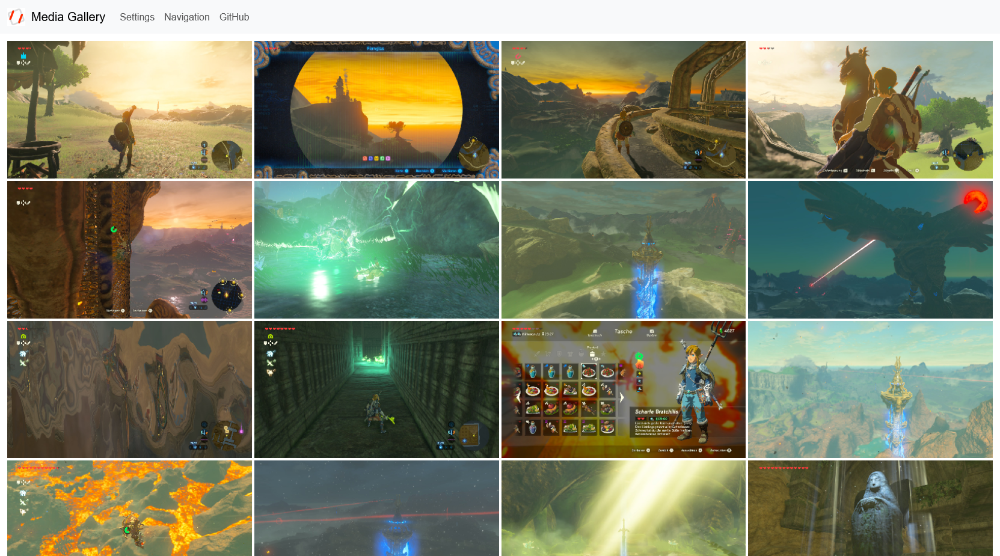
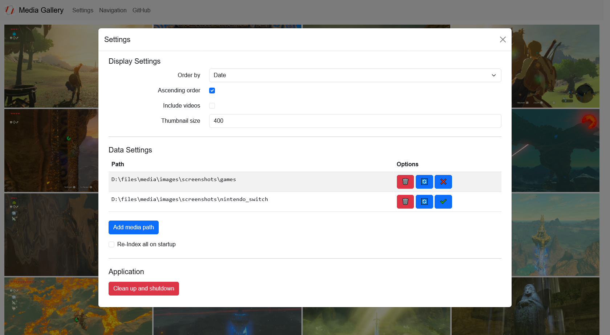
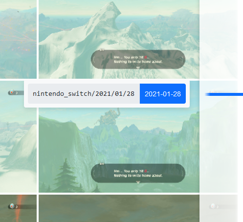

# Media Gallery

This project aims to provide a simple and easy media gallery for viewing your local photos and videos in a timeline,
like in Google Photos.

## Screenshots

View all your images and videos in a timeline.



Edit various display parameters.



Quickly jump to a specific date or directory and see your current position.



## Features

### Local indexing

By indexing the directories you specify, the application will be able to very quickly query your media files and update
the display when you change display parameters.

### Endless scrolling and large amounts of media files

The application will load more media files as you scroll down the timeline and unload those that are no longer visible
to allow for scrolling through endless amounts of media files in a single timeline. This is why the application supports
very large amounts of media files.

### Video support

The application supports video files and will display a thumbnail of the video.

## How to use

### Pre-built binaries

Head to [the releases](https://github.com/YanWittmann/media-gallery/releases) and download the latest version. You will
need at least Java 11 to run the application.

### Build from source

You will need at least Java 11 and [Maven](https://maven.apache.org/download.cgi) to build the application.  
Clone this repository and run the following command to build the application:

```shell
mvn clean package
```

The application will be built in the `target` directory. Simply run the jar file to start the application.

Or you can run it directly from Maven:

```shell
mvn spring-boot:run
```

### Accessing the interface

The application will start a web server on port `8080` by default. You can access the interface by opening the URL
`http://localhost:8080` in your browser.

### Indexing media files

By default, there will be no images visible in the timeline. You will need to index the directories containing your
media files. To do so, click on the `Settings` button at the top of the page and `Add media path`.

This might take a short while depending on the amount of media files you have. After it is done, the timeline will be
populated with your media files. You can remove or temporarily disable a media path by using the buttons next to the
path in the table above the button. There, you can also request a re-indexing of a path, as the application will not
automatically detect changes in the file system.

In the settings menu, you can also change various display parameters, such as the thumbnail size, the sorting order or
whether to display videos.

### Media navigation

The timeline is navigable by scrolling up and down. You can also move your mouse cursor all the way to the right side of
the page to reveal a navigation bar. It shows you where you currently are in the timeline and allows you to quickly jump
to a specific date or directory by clicking on it.

You can maximize a media file by clicking on it. This will show you the media file in its original size. There, you can
use the arrow keys or the arrows on the sides of the screen to navigate through the media files.

By double-clicking a media file in the timeline, you can reveal it in your file explorer.

### Exiting the application

The application will keep the thumbnails it generates for up to 5 minutes to speed up repeated access. These files might
not be removed properly if you simply end the task. To properly exit the application, click on the `Settings` button at
the top of the page and then on `Clean up and Shutdown`.

## Todo

- preloading of 2 images
- add file information to large display of image and open in file explorer
- add more image and video formats
- "jump to date and directory" should disable loading of pages until the date is reached
- "jump to date and directory" should not try to scroll for a fixed amount of time, but rather until the date is reached
